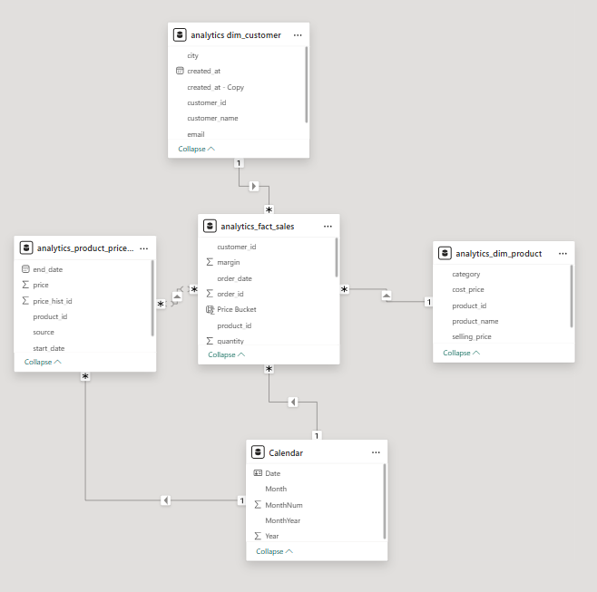

# Azure E-Commerce Data Engineering Project

## End-to-End Azure Data Engineering Pipeline for Revenue Analytics

---

## 📌 Problem Statement
E-commerce data is generated from multiple sources such as APIs and transactional systems, often arriving in raw, inconsistent, and semi-structured formats. Business teams require **accurate and trustworthy revenue metrics** that correctly account for promotions, discounts, partial returns, and order lifecycle changes (shipped vs returned).  
Without a standardized data pipeline, revenue reporting becomes unreliable and difficult to scale.

---

## 🎯 Solution Overview
This project implements an **end-to-end Azure-based data engineering pipeline** that ingests, transforms, and models e-commerce data into analytics-ready datasets using a **medallion architecture (Bronze, Silver, Gold)**.

Key outcomes:
- Centralized ingestion of API and transactional data
- Standardized transformations and schema enforcement
- Revenue correction logic incorporating promotions and returns
- Analytics-ready fact and dimension tables for BI consumption

---

## Project Flow (End-to-End)

1. Source data is ingested using Azure Data Factory into the Raw (Bronze) layer in ADLS Gen2.
2. Data is cleaned, standardized, and validated in Databricks using Spark SQL (Silver layer).
3. Analytics-ready fact and dimension tables are created in the Curated (Gold) layer using Delta Lake.
4. Curated datasets are consumed via SQL queries and Power BI for reporting and analysis.


---

## 🏗️ Architecture
**Medallion Architecture**
- **Bronze (Raw):** Immutable source data from APIs and transactional systems
- **Silver (Staging):** Cleaned, typed, and validated datasets
- **Gold (Curated):** Analytics-ready fact and dimension tables

> Tools Used:
- Azure Data Factory (ADF)
- Azure Data Lake Storage Gen2
- Databricks (Spark SQL)
- Azure Synapse Analytics
- Power BI (optional for visualization)

---

## 🔄 Data Ingestion
- Implemented parameterized ingestion pipelines using **Azure Data Factory**
- Ingested API-based e-commerce data into ADLS Gen2
- Applied date-based partitioning for traceability and incremental loads
- Ensured raw data immutability for audit and replay purposes

---

## 🔧 Data Transformation
- Performed transformations using **Databricks and Spark SQL**
- Applied schema enforcement and data type standardization
- Removed unnecessary columns and handled null values
- Implemented business rules for revenue calculation

---

## Data Modeling (Curated / Gold)

The curated layer follows dimensional modeling principles and implements
multiple star schemas for analytics use cases.

### Fact Tables
- `fact_orders` – Core sales and revenue analytics
- `fact_competitor_prices` – Competitor pricing analysis

### Dimension Tables
- `dim_customers`
- `dim_products`
- `dim_promotion`

---

## 🧪 Data Quality & Validation
Implemented validation checks to ensure data accuracy:
- Detection of duplicate order items
- Validation of negative or null revenue values
- Referential integrity checks between fact and dimension tables

---

## 📊 Results & Impact
- ✅ Improved revenue accuracy by **~5–7%** by accounting for returns and discounts
- ✅ Created a single source of truth for sales and revenue metrics
- ✅ Enabled MoM and YoY revenue analysis
- ✅ Reduced analytical query complexity for downstream BI users

---

## 🚀 Business Use Cases Enabled
- Revenue and profitability reporting
- Promotion effectiveness analysis
- Return impact analysis
- Executive and operational dashboards

---

## 📁 Repository Structure

```text
azure-ecommerce-data-engineering/
├── architecture/
├── ingestion/
├── transformations/
├── modeling/
├── data_quality/
├── analytics/
└── results/`
```

## ▶️ How to Run This Project
1. Ingest source data using Azure Data Factory pipelines
2. Execute Databricks notebooks to transform data from Bronze → Silver → Gold
3. Query curated tables using Azure Synapse or SQL
4. (Optional) Connect Power BI to curated tables for reporting

## ⚠️ Assumptions & Limitations
- Source data represents a simulated e-commerce environment
- Late-arriving returns are handled during scheduled pipeline refreshes
- Project focuses on batch processing rather than real-time streaming

### ⭐ Star Schema (Analytics Layer)


The curated analytics layer follows a star schema design with `fact_sales` as the central fact table and customer, product, and date dimensions.

## Repository Navigation
Each folder in this repository contains its own README.md describing
the responsibilities, design decisions, and implementation details
for that stage of the data pipeline.


